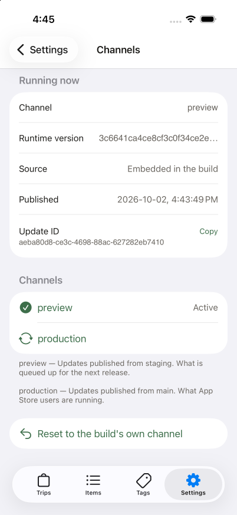
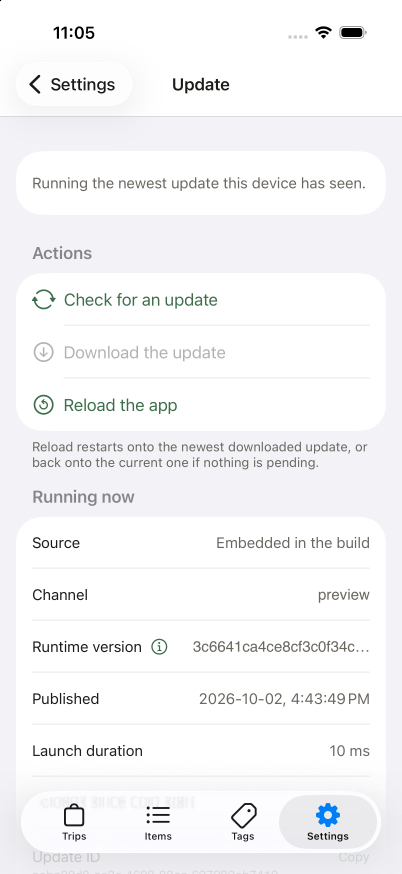

# react-native-ota-debug-screens

Drop-in debug screens for over-the-air updates in Expo apps. Put them behind a
hidden route or a developer menu, and anyone holding a build can:

- see which bundle it is running, on which channel and runtime version
- check for an update, download it, and reload onto it by hand
- switch between the update channels you allow, and back again
- crash the app on purpose, to test crash reporting

**For Expo apps only.** Needs Expo SDK 56 or newer, `expo-updates`, and a
build made by EAS. It does not work in a React Native app without Expo.

<p>
  
  &nbsp;
  
</p>

The screens are built from `@expo/ui`, so they render as a SwiftUI `Form` on
iOS and a Compose grouped list on Android. Above: iOS, themed with an app's
own accent colour.

## Quick start

**1. Install it** with its peer dependencies:

```bash
npx expo install react-native-ota-debug-screens expo-updates expo-constants expo-clipboard @expo/ui @expo/material-symbols
```

The package itself is JavaScript only. `@expo/ui` and `expo-clipboard` are
native modules, though: if your app does not have them yet, installing them
changes your fingerprint and you need a new build.

**2. Give each build profile a channel** in `eas.json`. Channel switching
works by replacing the channel header the build already sends, so a build with
no channel cannot switch.

```json
{
  "build": {
    "preview": { "channel": "preview" },
    "production": { "channel": "production" }
  }
}
```

**3. Add a screen.** With Expo Router, make a route file:

```tsx
// app/debug.tsx
import { DebugScreen } from 'react-native-ota-debug-screens';

export default function Debug() {
  return (
    <DebugScreen
      channels={[
        { name: 'preview', description: 'What is queued up for the next release.' },
        { name: 'production', description: 'What store users are running.' },
      ]}
      showCrashTest
    />
  );
}
```

**4. Make a build with EAS** (`eas build --profile preview`), open the screen,
and tap a channel. It checks that channel, downloads its newest update, and
reloads onto it.

## Screens

| Screen | What it shows |
| --- | --- |
| `UpdatesScreen` | The running bundle, the last check, the config, the raw manifest, and check / download / reload |
| `ChannelsScreen` | The channels in `channels`, one tap each, plus a reset to the build's own channel |
| `DebugScreen` | Both of the above in one form |

## Props

| Prop | Screens | Default | |
| --- | --- | --- | --- |
| `channels` | Channels, Debug | required | The channels a tester can switch to. A string, or `{ name, description }`. |
| `allowCustomChannel` | Channels, Debug | `false` | Adds a text field for any channel name, not only the listed ones. |
| `showCrashTest` | Updates, Debug | `false` | Adds a two-tap deliberate crash, to exercise crash reporting. |
| `colors` | all | system palette | `{ text, textMuted, accent, danger }`, any subset. |
| `bottomInset` | all | `0` | Space to keep clear for a floating tab bar. |

Only the channels you list can be reached. Leave `allowCustomChannel` off in
builds that testers outside your team hold.

## Navigation

The screens are plain React components. They do not import Expo Router or
React Navigation, so you can put one anywhere a component goes. Each fills
its parent and scrolls by itself.

With React Navigation:

```tsx
import { ChannelsScreen, UpdatesScreen } from 'react-native-ota-debug-screens';

const CHANNELS = ['preview', 'production'];

<Stack.Navigator>
  <Stack.Screen name="Updates" component={UpdatesScreen} />
  <Stack.Screen name="Channels">{() => <ChannelsScreen channels={CHANNELS} />}</Stack.Screen>
</Stack.Navigator>;
```

In a modal:

```tsx
<Modal visible={open} onRequestClose={() => setOpen(false)}>
  <DebugScreen channels={CHANNELS} />
</Modal>
```

## Your own layout

The sections are exported too. Put them in a `DebugForm`, and wrap that in
`DebugColorsProvider` to set colours:

```tsx
import {
  ChannelSections,
  CrashTestSection,
  DebugColorsProvider,
  DebugForm,
} from 'react-native-ota-debug-screens';

<DebugColorsProvider colors={{ accent: '#3d6e4a' }}>
  <DebugForm>
    <ChannelSections channels={['preview', 'production']} />
    <CrashTestSection />
  </DebugForm>
</DebugColorsProvider>;
```

## How channel switching works

The build ships with an `expo-channel-name` request header. Tapping a channel
calls `Updates.setUpdateRequestHeadersOverride({ 'expo-channel-name': name })`,
checks that channel, downloads its newest update, and reloads onto it. "Reset"
clears the override; relaunch the app to go back to the build's own channel.

- The override can only replace a header the binary already sends, which is
  why step 2 matters.
- A channel only serves updates for the runtime version it was published for.
  A channel with nothing for this runtime leaves the app where it is, and the
  screen says so.
- In a development build, Expo Go, or on web, `expo-updates` is disabled or
  serves from the dev server. The screens say so and disable the actions.

## Troubleshooting

**`ERESOLVE` on `react-dom` when installing on SDK 56.** Your app has no
`react-dom` yet, and `@expo/ui` 56 needs one. Run `npx expo install react-dom`
first, so you get the version that matches your React.

**`InvalidRequestHeadersOverrideException` when tapping a channel.** The build has
no channel. Add one to its profile in `eas.json` and build again.

## Development

```bash
npm install
npm run build   # compiles src/ to build/
npm pack        # builds, then makes the tarball npm would publish
```

To try a change in an app before publishing, install the tarball there:
`npm install ../react-native-ota-debug-screens/react-native-ota-debug-screens-0.1.0.tgz`.

## License

MIT
